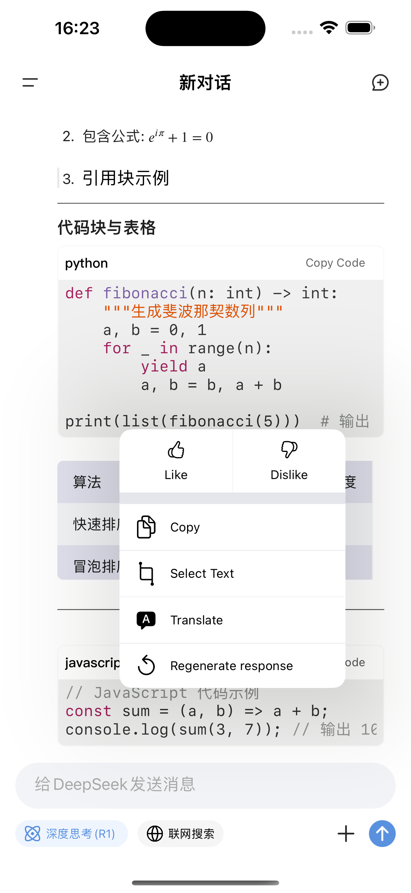
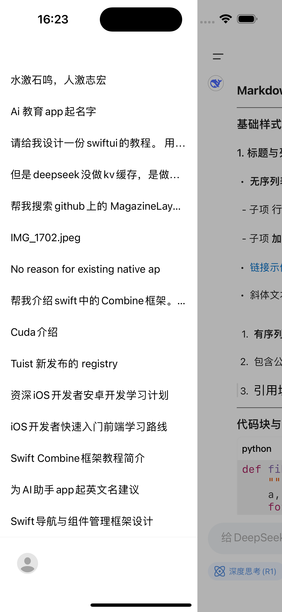
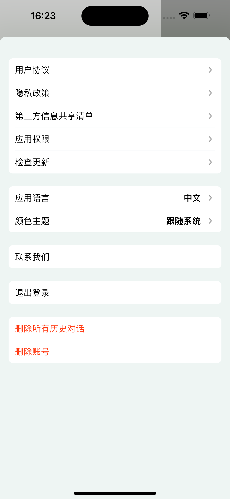

# DeepSeek-iOS

DeepSeek-iOS is an open-source iOS client implemented in Swift. The project is in its early stages and aims to explore and practice effective code design and frameworks.

**This project is for educational and exchange purposes only. Some image resources are used from the official DeepSeek app. I am not responsible for any other use.**

## Setup

This project uses [Tuist](https://tuist.io/) for project generation. Follow these steps to get started:

1. **Install Tuist**: If you haven't already, install Tuist by running:
   ```bash
   bash <(curl -Ls https://install.tuist.io)
   ```

2. **Generate the Xcode Project**:
   ```bash
   tuist generate
   ```

3. **Open the Project**:
   ```bash
   open DeepSeek.xcworkspace
   ```

## Screenshots

Here are some screenshots of the application:

<p align="center">    </p>

## Requirements

- iOS 14.0+
- Xcode 16.0+
- Swift 5.0+

## License

This project is licensed under the Apache-2.0 license. See the [LICENSE](LICENSE) file for details.
